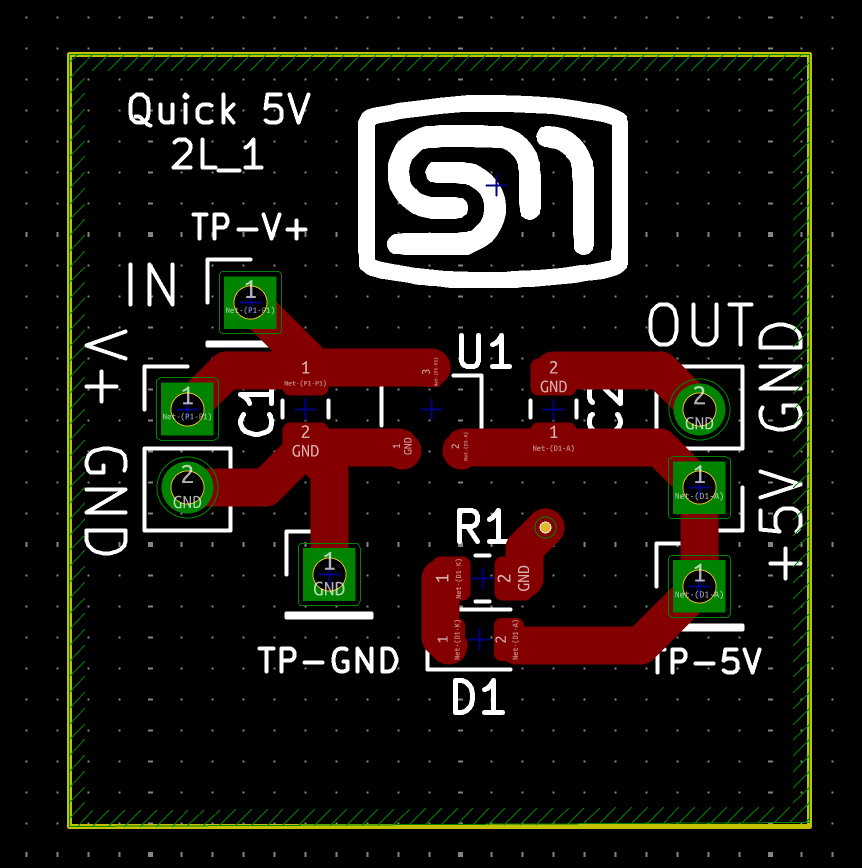
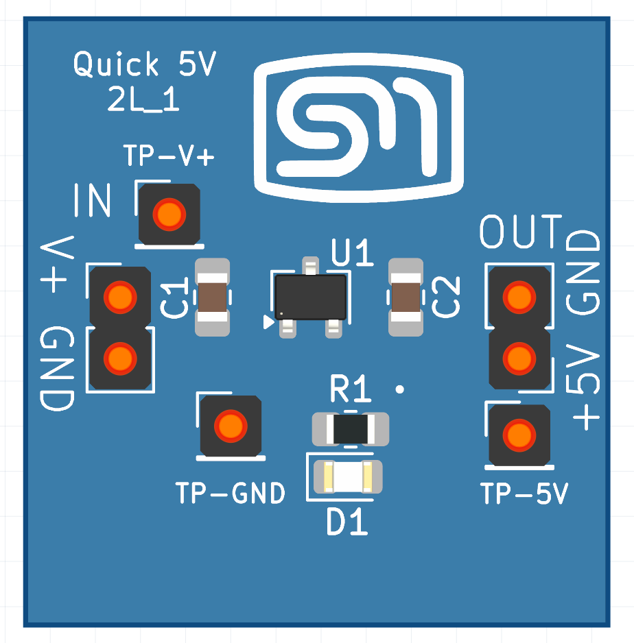

# PCB to Fritzing Part

A KiCad Action Plugin (and CLI utility) for generating Fritzing-compatible part assets from KiCad PCB layout data.

## Overview

### Visual Comparison: KiCad PCB vs Fritzing Import

| KiCad PCB (source) | Fritzing Import (generated) |
|:------------------:|:--------------------------:|
|  |  |

*Left: Original board in KiCad. Right: Generated part imported into Fritzing (photorealistic 3D mode, pads/labels preserved).*

This project is aimed at making documentation easier by converting KiCad board information into a Fritzing part that can be dropped into wiring diagrams.

Current status:
- Python package scaffold and CLI entry point are in place.
- Initial KiCad Action Plugin skeleton exists.
- Initial KiCad PCB parser extracts nets, footprints, and pads into an intermediate model.
- Starter connector mapping generates a Fritzing-oriented connector model.
- Connector extraction is currently focused on **pin header footprints** (first production-ready scope).
- Connector labels currently prefer explicit pin/net names, then fall back to reference-based names like `P1_1`.
- Minimal `.fzp` part generation is implemented from connector model data.
- SVG view generation uses parsed connector coordinates from the board model.
- Board outline is extracted from KiCad `Edge.Cuts` and used in generated SVG board shapes.
- Supported Edge.Cuts primitives now include `gr_rect`, `gr_line`, `gr_poly`, and `gr_arc`.
- Artifact consistency validation checks connector IDs across generated files.
- **Generated `.fzpz` packages** are ready for import directly into Fritzing.
- Generated `.fzp` metadata now includes non-empty `family` and `type` properties (required by Fritzing local parts indexing).
- KiCad plugin dialog exposes user-editable **Part Family** and **Part Type** fields with safe defaults.
- Reference artifacts are organized under `references/`.

## Repository Layout

- `src/pcb2fritzing/`: Main Python package.
- `src/pcb2fritzing/core/`: Extraction and conversion logic.
- `src/pcb2fritzing/kicad/`: KiCad extension/plugin integration code.
- `PROJECT_TRACKER.md`: Ongoing development checklist and focus tracking.
- `references/fritzing-parts/`: `.fzp` reference files.
- `references/kicad-exports/`: KiCad export SVG references.
- `references/kicad-projects/`: KiCad project references for parser/converter development.
- `references/samples/`: Misc sample and sketch artifacts.
- `scripts/build_kicad10_dist.py`: Build script for KiCad 10 distribution artifacts.
- `dist/`: Built KiCad extension artifacts (generated).
- `docs/KICAD10_EXTENSION_INSTALL.md`: KiCad 10 extension install instructions.

## Development Setup

```bash
python3 -m venv .venv
. .venv/bin/activate
pip install -e src
pip install -e "src[dev]"
```

## CLI Execution

```bash
pcb2fritzing path/to/board.kicad_pcb --out-dir build/fritzing-part
```

Override the default board-derived part/package name:

```bash
pcb2fritzing path/to/board.kicad_pcb --out-dir build/fritzing-part --part-name my-custom-part
```

For now, this creates placeholder output to validate project wiring and flow.
It also writes an intermediate model file: `board_model.json`.
It now also writes a connector model file: `fritzing_connectors.json`.
It also writes a starter Fritzing part file named after the board, e.g. `my-board.fzp`.
It also writes placeholder SVG view files: `icon.svg`, `breadboard.svg`, `schematic.svg`, `pcb.svg`.
It writes a validation report: `artifact_validation.json`.
It writes a shareable package named after the board, e.g. `my-board.fzpz`.

Fritzing metadata fields can be customized from the KiCad plugin dialog:
- `Part Family` (default: `KiCad2Fritzing Generated`)
- `Part Type` (default: `Custom PCB`)

These values are written into the generated `.fzp` under `<properties>` and influence how Fritzing categorizes and indexes the part.

KiCad plugin dialog behavior (current):
- `Generate` runs export without closing the dialog; use `Close` to dismiss it.
- `Output messages` shows step-by-step diagnostics during export.
- `Save...` writes diagnostics to a text file for troubleshooting.
- In photorealistic 3D mode, 2D silkscreen overlays are removed before embedding the 3D render to avoid ghosting/double text.

Known limitation (photorealistic mode):
- Some boards may still show subtle shadow artifacts in the embedded 3D render.
- This does not affect connector IDs, pin mapping, or generated package validity.

Optional unsupported workaround:
- If Pillow (`PIL`) is available in KiCad's Python runtime, the plugin applies a soft shadow suppression pass before embedding the render.
- If Pillow is not installed, export continues normally with no failure; only the suppression pass is skipped.
- This is intentionally optional to keep public plugin installs dependency-free.

## KiCad Extension Direction

The Action Plugin scaffold is available in `src/pcb2fritzing/kicad/plugin.py`.

Planned behavior:
- Run from KiCad PCB Editor.
- Read current open board.
- Emit starter Fritzing artifacts next to the board file.

## KiCad 10 Extension Packaging And Install

Build distribution artifacts:

```bash
python3 scripts/build_kicad10_dist.py
```

Generated artifacts:
- `dist/pcb2fritzing-pcm/`
- `dist/PCB2FritzingPart-pcm.zip`

Install path on macOS for KiCad 10 Action Plugins:
- `~/Library/Application Support/kicad/10.0/scripting/plugins`

Detailed install steps are in:
- `docs/KICAD10_EXTENSION_INSTALL.md`

## Next Steps

- Capture and reproduce board-specific compatibility issues with minimal fixtures.
- Add targeted failing tests before each board-specific fix.
- Harden parser coverage for board/footprint edge cases (text, layers, geometry variants).
- Validate connector IDs/names/mappings on at least two real board designs.
- Validate generated `.fzp` schema assumptions against actual Fritzing import behavior.
- Add CLI parity flags for plugin metadata controls (`--part-family`, `--part-type`).
- Add round-trip checks using Fritzing import/export where practical.
- Expand plugin behavior and end-to-end integration tests.
- Plan and execute migration from deprecated KiCad SWIG bindings to the supported IPC plugin framework.
- Add CI to run tests automatically on push/PR.

## Testing

Run tests from repository root:

```bash
. .venv/bin/activate
pytest
```

Current tests cover:
- Placeholder extractor output creation.
- Intermediate board model and connector model generation.
- Minimal `.fzp` generation from connector model.
- Placeholder SVG generation and connector ID consistency validation.
- CLI argument parsing and output generation flow.

Optional external-project integration test (disabled by default):

This test can clone a KiCad project repo at test time, parse it, and validate generated artifacts without storing the project in this repository.

The test reads a local secret config at [tests/external_projects.local.json](tests/external_projects.local.json) and runs one case per enabled entry. Add or remove projects there, or point `K2F_EXTERNAL_PROJECTS_CONFIG` at another JSON file with the same shape.

A public sample is provided at [tests/external_projects.sample.json](tests/external_projects.sample.json). Copy it to `tests/external_projects.local.json` and edit it for your own projects.

Each project entry supports:
- `name` for the pytest test id.
- `repo_url` for the Git URL.
- `branch` for the target branch.
- `enabled` to temporarily disable an entry without deleting it.
- `repo_subdir` and `board_rel_path` for projects that keep the KiCad board in a subfolder or specific file.

Example with LoudMouth `k10_update`:

```bash
. .venv/bin/activate
RUN_EXTERNAL_PROJECT_TESTS=1 \
pytest tests/test_external_projects.py -q
```

Useful optional variables:
- `K2F_EXTERNAL_PROJECTS_CONFIG` to use a different JSON config file.
- `K2F_EXTERNAL_REPO_URL` and `K2F_EXTERNAL_REPO_BRANCH` to override the config for a one-off run.
- `K2F_EXTERNAL_REPO_SUBDIR` to limit search to a folder inside the cloned repo.
- `K2F_EXTERNAL_BOARD_PATH` to target a specific `.kicad_pcb` file relative to that folder.

Rendering tuning:
- `K2F_SILK_TEXT_SCALE` adjusts silkscreen text size in generated SVGs (default `1.15`).
	Example: `K2F_SILK_TEXT_SCALE=1.22` for slightly larger board labels.

## Fritzing Import Notes

- If you previously imported early generated parts and see startup warnings from Fritzing local parts scanning, remove stale `pcb2fritzing.*` entries from:
  - `~/Library/Application Support/Fritzing/Fritzing/local_parts/user/`
- Re-import a newly generated `.fzpz` from this version to refresh metadata with required `family/type` properties.
